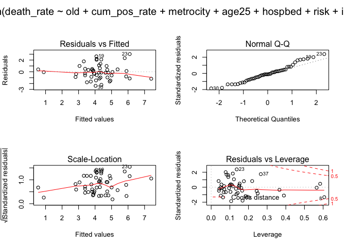
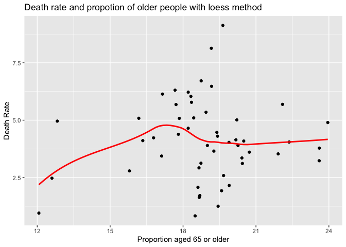
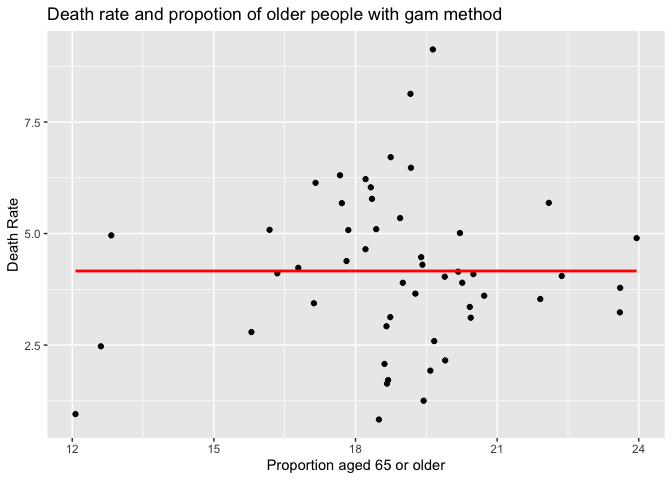
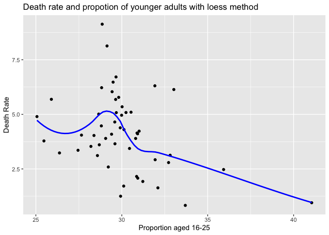
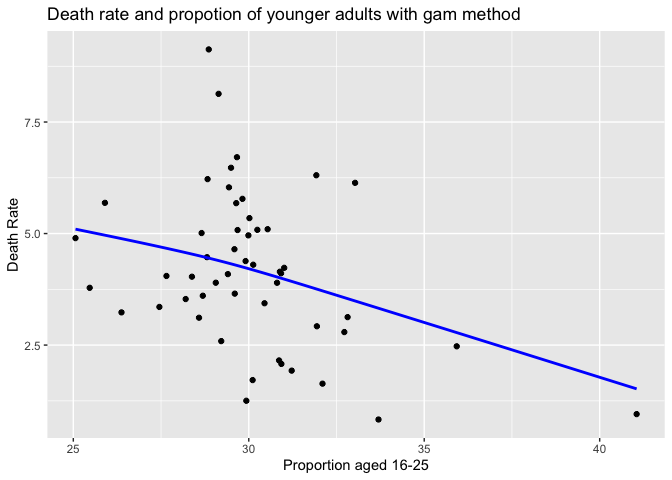
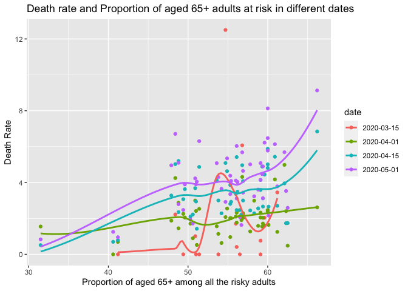
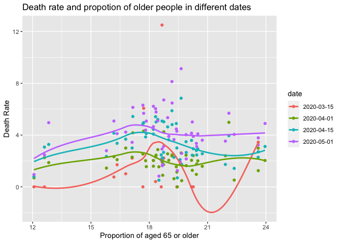
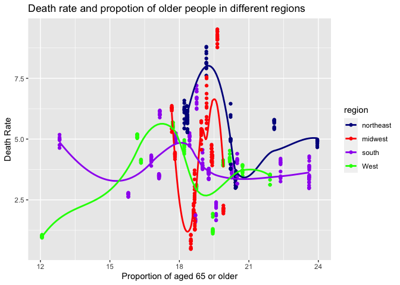

479code
================

### Data cleaning and Data Wrangling

``` r
library(dplyr)
library(tidyverse)
library(jsonlite)
dat_url <- "https://covidtracking.com/api/v1/states/daily.json" # API
seniors <- read.csv("./data/agedata.csv") %>% select(STATEFIP,old)%>%mutate(old=old*100)
kff=read.csv("./data/kffdata.csv")%>% select(-X)%>%rename(risk=age65risk...100)
acs=read.csv("./data/acs.csv")%>% select(-X)

# Combining the data
covid <- merge(fromJSON(dat_url), read.csv("./data/StateName.csv")) %>%
  mutate(date=as.character(date),
         date=as.Date(date, format="%Y%m%d"), 
         daily_positive=positiveIncrease,
         daily_tested=totalTestResultsIncrease,
         daily_pos_rate=positiveIncrease/totalTestResultsIncrease*100,
         death_rate=death/positive*100)
covid1 <- covid %>% filter(state_name!="US Virgin Islands",state_name!="Northern Mariana Islands",state_name!="American Samoa",state_name!="Guam",state_name!="Puerto Rico") %>% group_by(state_name) %>% arrange(date) %>% mutate(Cumulative_positive=positive, Cumulative_tested=totalTestResults) %>%
  mutate(cum_pos_rate=Cumulative_positive/Cumulative_tested*100)%>%mutate(fips=as.numeric(fips))
  
# Filter the data to focus on May 1st data
covid2=covid1%>%filter(date=="2020-05-01")%>%left_join(seniors,by=c("fips"="STATEFIP"))
covid3 <- covid2 %>% left_join(acs,by=c("fips"="STATEFIP"))

covid4=covid3%>%select(date,state_name,death_rate,old,cum_pos_rate,metrocity,age25,ins)
covid5=covid4%>%left_join(kff,by="state_name")
# Set extreme value to missing NA
covid5$metrocity[covid5$metrocity==0]=NA
# Sample statistics of two variables
mean(covid5$death_rate)
```

    ## [1] 4.160553

``` r
mean(covid5$old)
```

    ## [1] 18.87859

``` r
sd(covid5$death_rate)
```

    ## [1] 1.742771

``` r
sd(covid5$old)
```

    ## [1] 2.393375

Conduct Linear Regression Model
===============================

``` r
model1 <- lm(death_rate~old+cum_pos_rate+metrocity+age25+hospbed+risk+ins,data=covid5)
summary(model1)
```

    ## 
    ## Call:
    ## lm(formula = death_rate ~ old + cum_pos_rate + metrocity + age25 + 
    ##     hospbed + risk + ins, data = covid5)
    ## 
    ## Residuals:
    ##     Min      1Q  Median      3Q     Max 
    ## -2.3972 -0.8801 -0.1363  0.4958  3.0260 
    ## 
    ## Coefficients:
    ##               Estimate Std. Error t value Pr(>|t|)  
    ## (Intercept)  12.270970   8.708135   1.409   0.1662  
    ## old          -0.279934   0.157157  -1.781   0.0821 .
    ## cum_pos_rate  0.067303   0.027289   2.466   0.0178 *
    ## metrocity    -0.001708   0.009320  -0.183   0.8555  
    ## age25        -0.318693   0.161995  -1.967   0.0558 .
    ## hospbed       0.129125   0.278947   0.463   0.6458  
    ## risk          0.101047   0.042107   2.400   0.0209 *
    ## ins           0.018291   0.073818   0.248   0.8055  
    ## ---
    ## Signif. codes:  0 '***' 0.001 '**' 0.01 '*' 0.05 '.' 0.1 ' ' 1
    ## 
    ## Residual standard error: 1.365 on 42 degrees of freedom
    ##   (1 observation deleted due to missingness)
    ## Multiple R-squared:  0.4539, Adjusted R-squared:  0.3629 
    ## F-statistic: 4.988 on 7 and 42 DF,  p-value: 0.0003589

``` r
# Model diagnostics
par(mfrow = c(2, 2), oma = c(0, 0, 2, 0))
plot(model1)
```



Plotting the death vs Age using scatterplot
===========================================

``` r
library(ggplot2)

ggplot(covid5, aes(x = old, y = death_rate)) + 
  geom_point() +
  stat_smooth(col ="red", se=FALSE)+
  labs(x = "Proportion aged 65 or older", y = "Death Rate",
       title = "Death rate and propotion of older people with loess method")
```



``` r
ggplot(covid5, aes(x = old, y = death_rate)) + 
  geom_point() +
  stat_smooth(col ="red", se=FALSE,method="gam")+
  labs(x = "Proportion aged 65 or older", y = "Death Rate",
       title = "Death rate and propotion of older people with gam method")
```



``` r
ggplot(covid5, aes(x = age25, y = death_rate)) + 
  geom_point() +
  geom_smooth(col ="blue", se=FALSE)+
  labs(x = "Proportion aged 16-25", y = "Death Rate",
       title = "Death rate and propotion of younger adults with loess method")
```



``` r
ggplot(covid5, aes(x = age25, y = death_rate)) + 
  geom_point() + 
  geom_smooth(col ="blue", se=FALSE,method="gam")+
labs(x = "Proportion aged 16-25", y = "Death Rate",
     title = "Death rate and propotion of younger adults with gam method")
```



``` r
ggplot(covid5, aes(x = risk, y = death_rate)) + 
  geom_point() +
  geom_smooth(col ="green", se=FALSE)+
  labs(x = "Proportion of aged 65+ among all the risky adults", y = "Death Rate",
       title = "Death rate and share of aged 65+ at risk with loess method")
```


``` r
ggplot(covid5, aes(x = risk, y = death_rate)) + 
  geom_point() +
  geom_smooth(col ="green", se=FALSE,method="gam")+
  labs(x = "Proportion of aged 65+ among all the risky adults", y = "Death Rate",
       title = "Death rate and share of aged 65+ at risk with gam method")
```


``` r
# Try the plot at different dates and shows how the curve varies

# First, clean the data 
covid10=covid1%>%filter(date=="2020-05-01"|date=="2020-03-15"|date=="2020-04-01"|date=="2020-04-15")%>%left_join(seniors,by=c("fips"="STATEFIP"))%>%mutate(date=as.factor(date))
covid11=covid10%>%left_join(kff,by="state_name")

ggplot(covid11, aes(x = risk, y = death_rate, color = date)) + 
  geom_point() +
  geom_smooth(se=FALSE)+
  labs(x = "Proportion of aged 65+ among all the risky adults", y = "Death Rate",
       title = "Death rate and Proportion of aged 65+ adults at risk in different dates")
```



``` r
ggplot(covid10, aes(x = old, y = death_rate, color = date)) + 
  geom_point() +
  geom_smooth(se=FALSE)+
  labs(x = "Proportion of aged 65 or older", y = "Death Rate",
       title = "Death rate and propotion of older people in different dates")
```



``` r
# Compare the death rate in different regions including west, midwest, northeast, south region

# First Process the data
covid12=covid1[order(covid1$date,decreasing=TRUE),]
covid12=covid12[1:612,]
# Load the data set which contains the region in order to compare
library(maps)
sf=state.fips
covid13=covid12%>%left_join(seniors,by=c("fips"="STATEFIP"))
covid13=covid13%>%left_join(sf,by="fips")%>%mutate(region=as.factor(region))
covid13=covid13[!is.na(covid13$region),]
ggplot(covid13, aes(x = old, y = death_rate, color = region)) + 
  geom_point() +
  geom_smooth(se=FALSE)+
  labs(x = "Proportion of aged 65 or older", y = "Death Rate",
       title = "Death rate and propotion of older people in different regions")+
  scale_colour_manual(labels = c("northeast", "midwest","south","West"),values = c("darkblue", "red","purple","green"))
```


